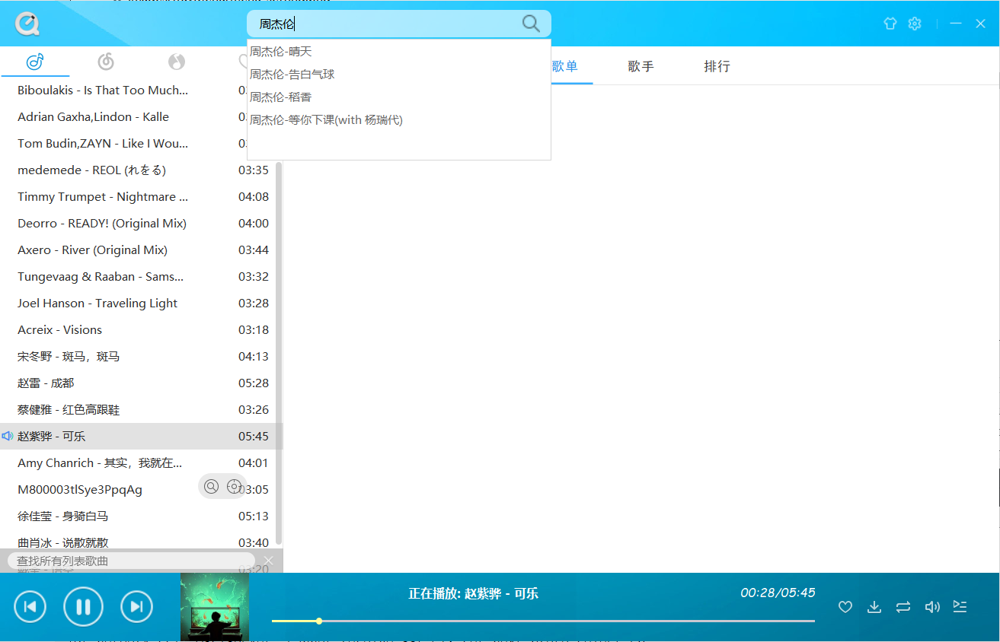
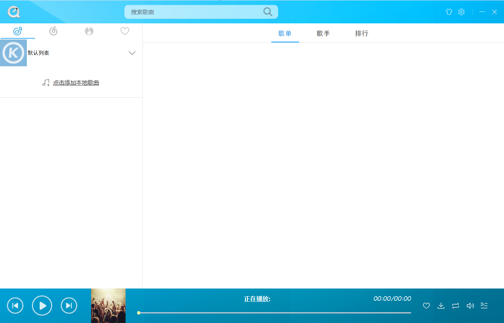
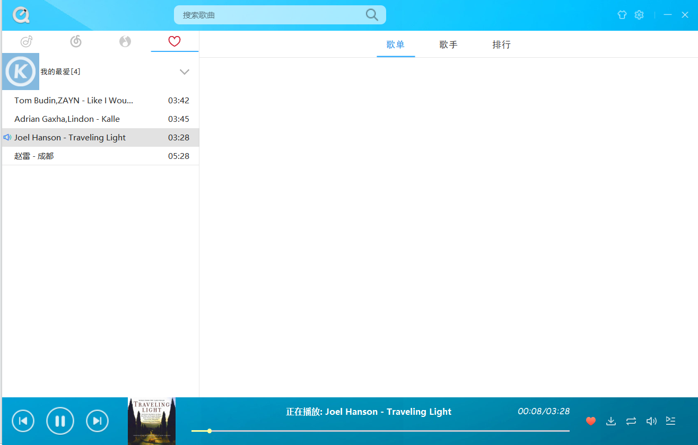
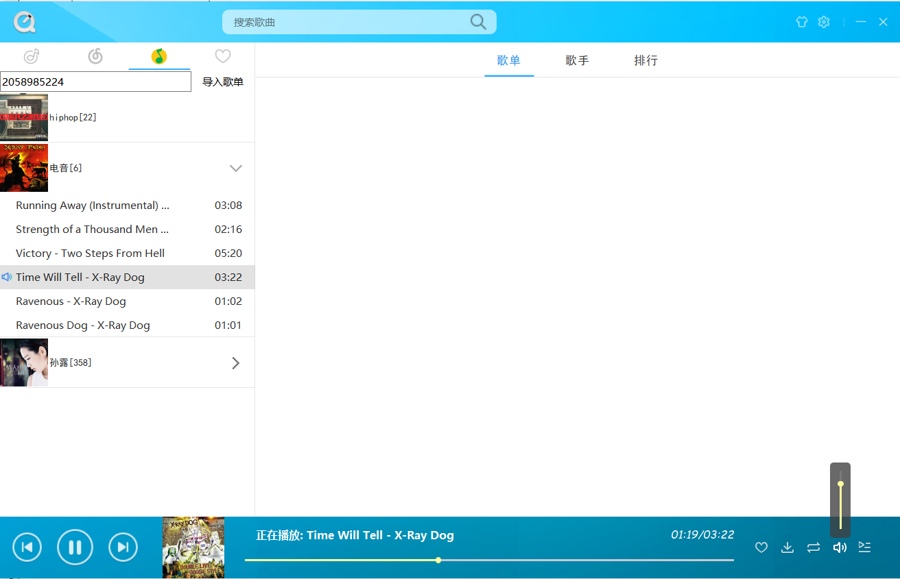
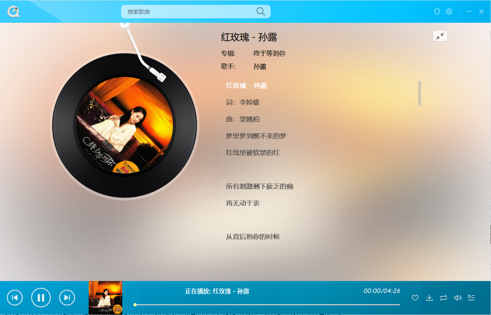

# QMusic

    
    

## 前言

`QMusic`是用QT+python开发的一个音乐播放器，音频解析部分采用的是ffmpeg，融合`网易云`+`QQ音乐`音源的开源项目。

## 项目介绍

#### 已实现的功能:
1. 本地音乐列表
2. 本地的我喜爱列表
3. 支持顺序/随机/单曲循环
4. QQ音乐导入歌单
5. 320kbps高品质音乐
6. 类酷狗音乐的主体风格
7. 类网易云音乐歌词界面
8. Netease和qq的api已基本实现(python版本)

#### 待完成:

1. 网易云登陆注销
2. 网易云用户歌单导入
3. 网易云风格的歌单歌手排行
4. QQ/Netease歌曲搜索

### 图片展示:

**PS：歌单号乱写导的。。**

## 搭建步骤

所需开发环境及依赖:

工具 | 版本号
----|----
QT | 5.6.1及以上 
Qt Creator | 4.0及以上 
python 32位 | 5.6.7 
postman | 6.7.4 

python依赖的包:

`requests`、`requests-cache`、`future`、`pycryptodome`

### 搭建

1. 配置ffmpeg环境(文末有参考项目链接)
2. 把本项目下的`MusicApi`文件夹内的python代码放入debug或release文件夹下
3. 本项目用的编译器为**MinGW 32bit**

## 参考项目

* [Beslyric](https://github.com/BensonLaur/Beslyric-for-X)
* [beslyric-lib](https://github.com/BensonLaur/beslyric-lib)(ffmpeg配置)
* [NetEase-MusicBox](<https://github.com/darknessomi/musicbox>)
* [mess-api](https://messoer.github.io/mess-api-doc/)
* [KuGouDemo](<https://github.com/what951006/KuGouDemo>)

## 申明

如有侵权，请联系删除 ~:innocent:

